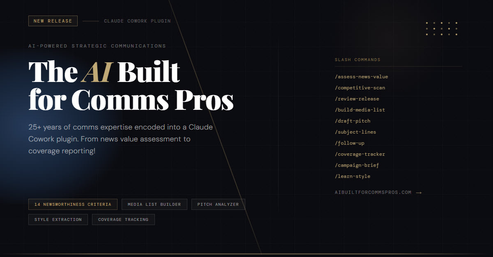

# PR Plugin for Claude Cowork

> **The AI Built for Comms Pros** — 25+ years of strategic communications expertise encoded into a zero-dependency Claude Cowork plugin. End-to-end press release pitching workflows, from news value assessment to coverage report.

🔥 🔥 🔥 Download PR Tools [here](https://github.com/Robert-Carlton/AI-Built-for-Comms-Pros/releases/tag/v4.0.0.0) 🔥🔥🔥
📗📗📗 Read the wiki / docs [here](https://github.com/Robert-Carlton/AI-Built-for-Comms-Pros/wiki) 📗📗📗

---

## What PR Tools>

A complete public relations toolkit that runs entirely within Claude Cowork — no Python environment, no API keys, no local dependencies. Install once, customize with your org's details, and every press release campaign runs through a structured, professional workflow.

The plugin encodes hard-won expertise across the full PR campaign lifecycle: how to assess whether a story is actually newsworthy, how to position against competitive announcements, how to build a media list that prioritizes quality over volume, how to write pitches that journalists actually read, and how to report results in a way that makes sense to leadership.

---

